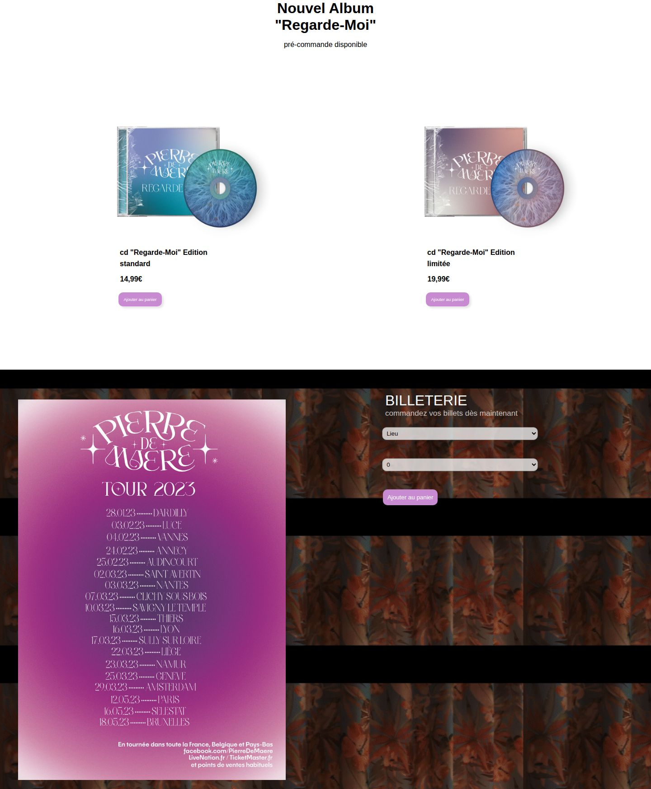

# Store Pierre de Maere

Maquette d'une boutique en ligne pour l'artiste Pierre de Maere, développée en React. Projet final réalisé en 2023 dans un cadre de formation, sans lien officiel avec l'artiste.


## Contenu de la page

Le site tient sur une seule page :

- en-tête avec le logo, un panneau de connexion et un panneau panier ;
- présentation de l'album "Regarde-Moi" en édition standard et limitée ;
- billetterie de la tournée 2023 avec choix du lieu et du nombre de places ;
- boutique de packs hoodies et CD avec sélection de la taille ;
- lecteur Spotify intégré ;
- inscription à la newsletter ;
- pied de page avec les liens vers les réseaux sociaux.

| Album et billetterie | Boutique |
| --- | --- |
|  |  |

## État du projet

Il s'agit d'une maquette front-end. Les boutons "Ajouter au panier", le formulaire de connexion et la newsletter ne sont pas encore reliés à une logique ou à une base de données. Une configuration Firebase est présente dans `src/componant/init.js` mais n'est pas encore utilisée par l'application.

## Technologies

- [React 18](https://react.dev/) avec [Create React App](https://create-react-app.dev/) (`react-scripts` 5)
- [React Router 6](https://reactrouter.com/)
- [Firebase 9](https://firebase.google.com/docs/web/setup) (configuré, non branché)
- HTML et CSS

## Installation et lancement

Prérequis : [Node.js](https://nodejs.org/) et npm. Le projet a été testé avec Node.js 22.

```bash
git clone https://github.com/gadj-oestar/projet-final-lab201.git
cd projet-final-lab201/projet-final-2023
npm install
npm start
```

L'application s'ouvre sur [http://localhost:3000](http://localhost:3000).

Pour générer une version de production dans le dossier `build/` :

```bash
npm run build
```

## Structure

```
projet-final-2023/
├── public/                     fichiers statiques (index.html, images de fond, icônes)
└── src/
    ├── App.js                  routes de l'application
    ├── index.js                point d'entrée React
    ├── componant/
    │   ├── init.js             configuration Firebase
    │   └── pierre de maere/    page principale et ses feuilles de style
    ├── identifiant/            panneau de connexion
    ├── panier/                 panneau panier
    └── img/                    images importées par les composants
```

## Auteur

Gad Tshipata ([@gadj-oestar](https://github.com/gadj-oestar))
