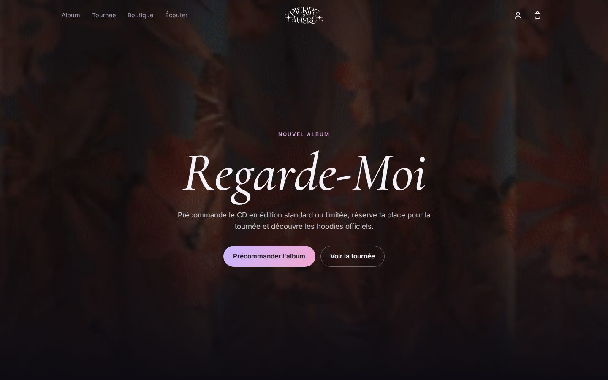
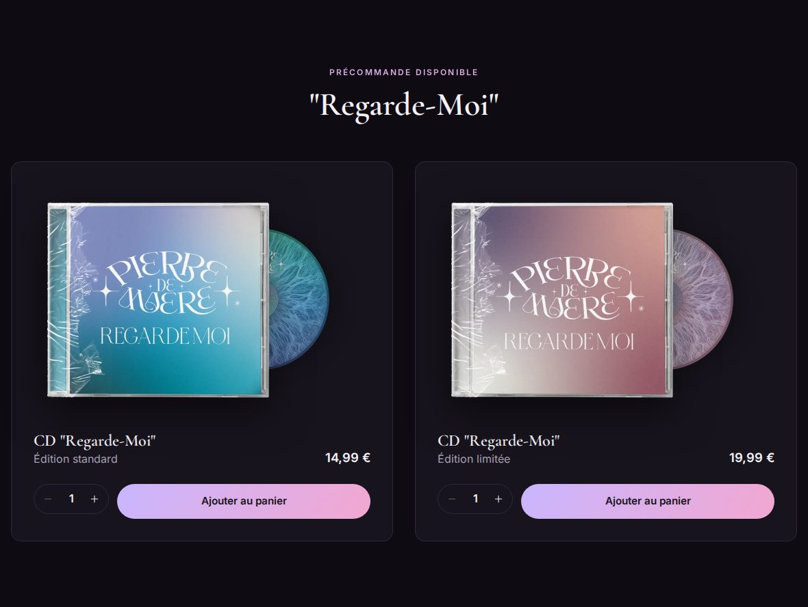
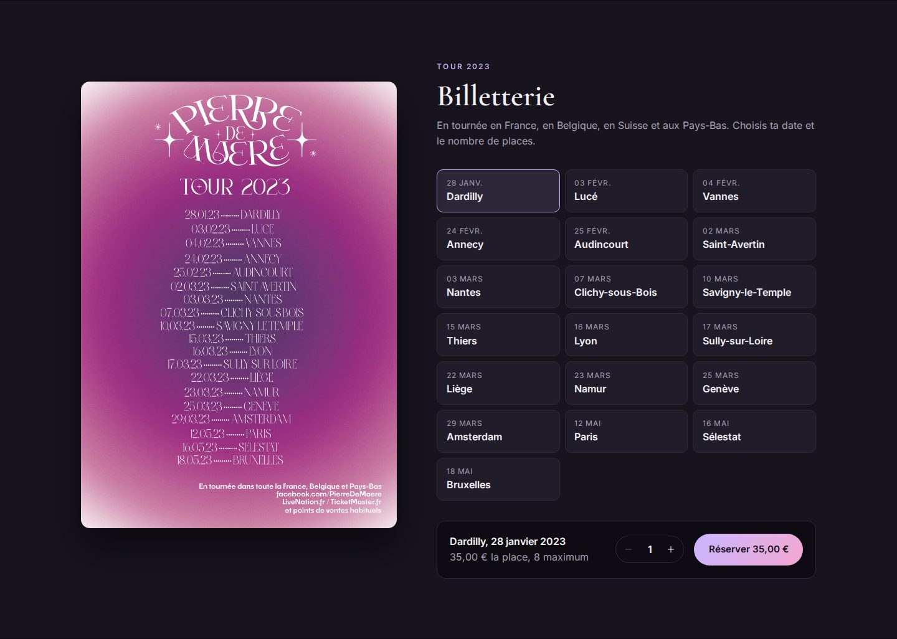
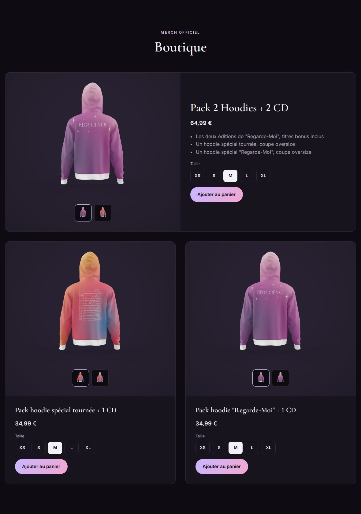
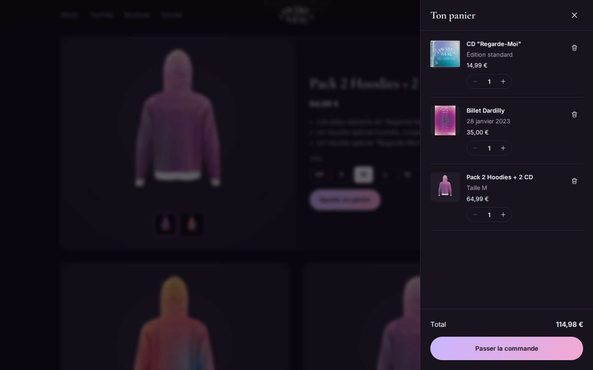
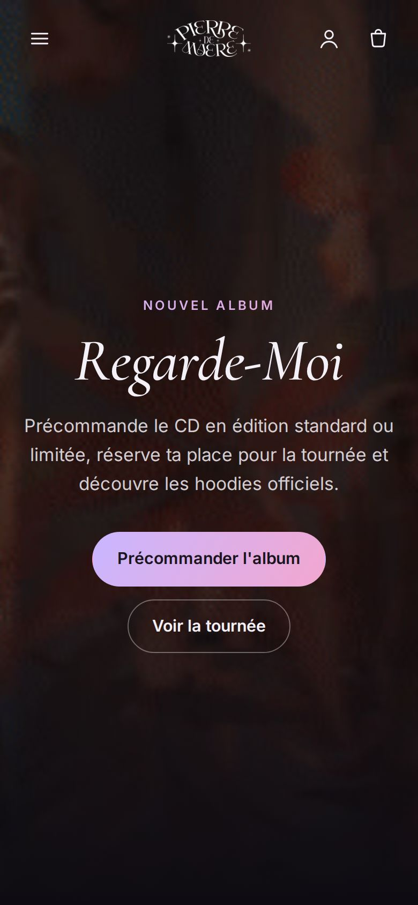

# Store Pierre de Maere

Boutique en ligne pour l'artiste Pierre de Maere, développée en React avec Firebase. Projet final réalisé en 2023 dans un cadre de formation, sans lien officiel avec l'artiste. Le paiement est simulé : aucune commande n'est débitée ni expédiée.



## Fonctionnalités

- Album "Regarde-Moi" en édition standard et limitée, avec choix de la quantité.
- Billetterie de la tournée 2023 : choix de la date (19 concerts) et du nombre de places, 8 au maximum.
- Boutique de packs hoodies et CD avec choix de la taille et galerie face/dos.
- Panier latéral : modification des quantités, suppression, total, sauvegarde dans le navigateur.
- Commande : coordonnées, adresse de livraison si le panier contient des produits physiques, frais de port, récapitulatif et confirmation avec numéro de commande.
- Comptes clients avec Firebase Authentication : inscription, connexion, mot de passe oublié, déconnexion.
- Page "Mon compte" avec l'historique des commandes.
- Inscription à la newsletter avec validation de l'adresse.
- Lecteur Spotify intégré.
- Design sombre et responsive (mobile, tablette, ordinateur), navigation au clavier.

| Album | Billetterie |
| --- | --- |
|  |  |

| Boutique | Panier | Mobile |
| --- | --- | --- |
|  |  |  |

## Technologies

- [React 18](https://react.dev/) avec [Create React App](https://create-react-app.dev/) (`react-scripts` 5)
- [React Router 6](https://reactrouter.com/)
- [Firebase 9](https://firebase.google.com/docs/web/setup) : Authentication et Realtime Database
- CSS sans framework, polices Cormorant Garamond et Inter (Google Fonts)
- Tests avec [Testing Library](https://testing-library.com/docs/react-testing-library/intro/)

## Installation et lancement

Prérequis : [Node.js](https://nodejs.org/) et npm. Le projet a été testé avec Node.js 22.

```bash
git clone https://github.com/gadj-oestar/projet-final-lab201.git
cd projet-final-lab201/projet-final-2023
npm install
npm start
```

L'application s'ouvre sur [http://localhost:3000](http://localhost:3000).

Autres commandes :

```bash
npm test          # lance les tests
npm run build     # génère la version de production dans build/
```

## Données et Firebase

- Le panier est stocké dans le navigateur (`localStorage`).
- Les comptes passent par Firebase Authentication (méthode email et mot de passe).
- Les commandes sont enregistrées dans la Realtime Database sous `commandes/<uid>` (ou `commandes/invites` sans compte), et les inscriptions newsletter sous `newsletter`. Si la base ne répond pas, une copie reste dans le navigateur pour que le parcours ne bloque pas.

Règles conseillées pour la Realtime Database (console Firebase, onglet Règles) :

```json
{
  "rules": {
    "commandes": {
      "invites": {
        "$id": { ".write": "!data.exists()" }
      },
      "$uid": {
        ".read": "auth != null && auth.uid === $uid",
        ".write": "auth != null && auth.uid === $uid"
      }
    },
    "newsletter": {
      "$id": { ".write": "!data.exists()" }
    }
  }
}
```

## Structure

```
projet-final-2023/
├── public/                 index.html, icônes, _redirects (routes Netlify)
└── src/
    ├── App.js              mise en page et routes
    ├── firebase.js         configuration Firebase
    ├── assets/             images et vidéo optimisées
    ├── components/         en-tête, panier, connexion, pied de page
    ├── context/            état du panier, de l'authentification et des notifications
    ├── data/catalogue.js   produits, prix et dates de concert
    ├── pages/              accueil, commande, compte, page introuvable
    ├── sections/           sections de la page d'accueil
    ├── services/           enregistrement des commandes et de la newsletter
    └── styles/global.css   design complet
```

## Auteur

Gad Tshipata ([@gadj-oestar](https://github.com/gadj-oestar))
